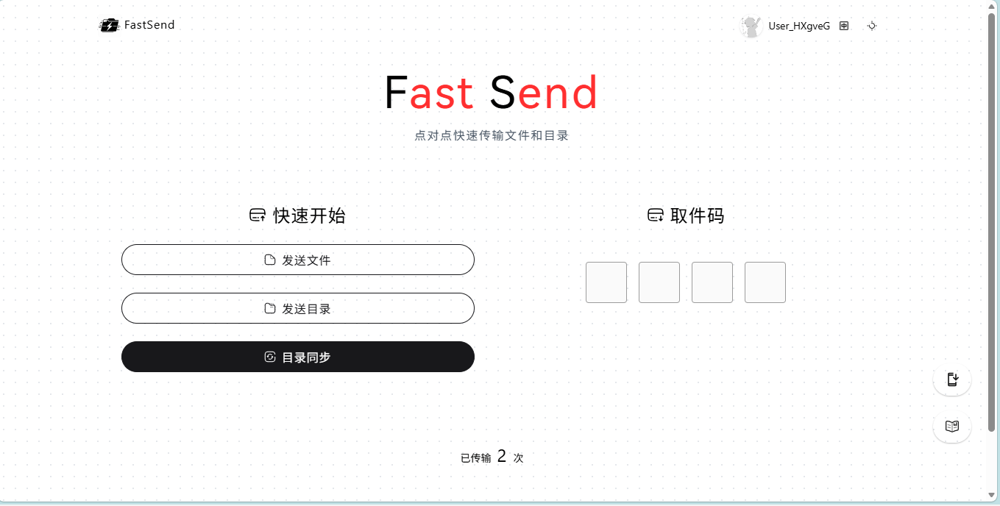
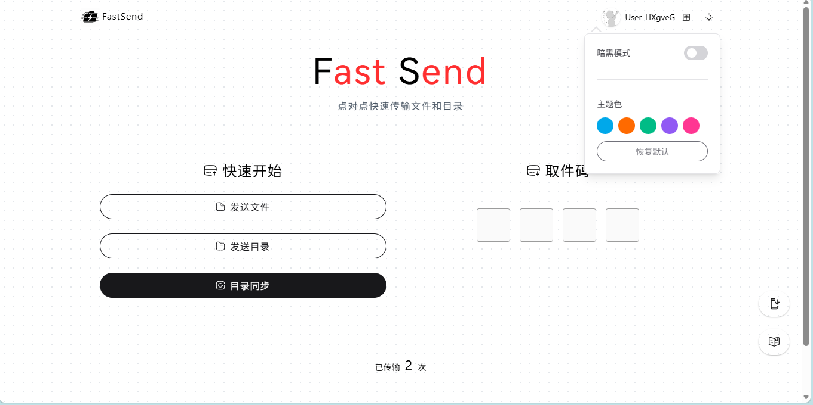
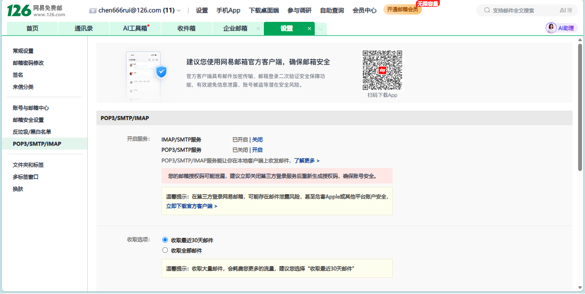

<h1 align="center">FastSend-Fork</h1>

<p align="center">
  
  <a href="#" target="_blank">
    
  </a>
</p>

<p align="center">
  
</p>

## 📖 项目介绍

FastSend-Fork 是基于 FastSend的分支，基于 WebRTC 技术的点对点文件传输工具，支持快速的目录同步和文件传输。通过浏览器即可实现安全、高效的文件共享。
在保留原版全部能力的基础上，于**传输内核、安全隐私、UI 体验、部署工程**四个维度进行了全面增强。

## 所需环境

- node.js ≥ 22
- Python 3（可选，隧道守护/邮件推送）
- cloudflared（可选，公网内网穿透）

## ✨ 特性

**基础特性（继承）**
- 🔒 点对点加密传输，确保数据安全
- 📁 支持文件和文件夹传输
- 🚀 局域网自动优化，传输更快
- 🎯 简单易用的界面设计
- 🌍 支持中英文界面
- 📲 支持PWA轻量安装
- 🎨 自定义界面颜色

<p align="center">
  
</p>

**增强特性**

🔥 全新传输模式
- 📝 **文本传送**：原文 / 代码高亮 / Markdown 渲染三模式切换
- 🔥 **阅后即焚**：AES-GCM 256 端到端加密，密钥只留 `#` 片段（零知识）；可选**口头暗语双因子**；溯源水印；24h 自毁
- 🩺 **一键诊断 `/check`**：HTTPS 上下文 / WebRTC / NAT 穿透自动体检

🚀 传输内核
-  **零拷贝流式读取**：`File.stream()` + 内存视图偏移修复，GB 级大文件 UI 保持 60fps
- 🛡️ **ICE 自动重启**：换网/闪断传输不死
- 🔥 **背压点火器**：修复大文件传输死锁
- ⏸️ **暂停/继续**：大文件传输一键冻结、随时续传
- 📋 **截图直发**：首页 `Ctrl+V` 粘贴截图直接发送
- 🖱️ **拖拽即发**：文件拖入页面任意位置触发发送
- 👀 **在线预览**：图片/视频/音频/PDF/文本接收后免落盘预览
- 🔁 **重复文件自动改名** `(1)/(2)`，不再无脑覆盖
- 🗂️ **自动分类落盘**：图片/视频/音频/文档/压缩包自动归位
- 🔐 **SHA-256 完整性指纹**：两端一致 = 字节级零损坏
- 📶 **RTT 信号条 / 📈 速度曲线 / ⏱️ ETA 预估**

🎨 体验与界面
- 🎨 主题系统：5 预设色 + 自定义取色器 + 暗黑模式 + 一键恢复
- ⌨️ 机械键盘音效 + 🔔 完成“叮”声 + 系统通知
- 🧠 智能取件：粘贴链接/取件码自动识别
- 📜 传输历史（仅本机）
- 💥 错误页（404/500 ）
- 🌐 新增页面中英双语完整支持

🛡️ 部署与安全
- 🔒 **自动 HTTPS**：自签名证书自动生成（825 天，含局域网 IP SAN）
- 🚀 **`start.bat` 一键启动** + 隧道守护崩溃自启 + 开机自启
- ☁️ **Cloudflare Workers 公共 Demo**
- 🩺 **`/api/health` 健康端点** + UptimeRobot 宕机通知
- 🚦 **信令限流防刷**：单 IP 每分钟 120 次上限
- 💓 **WS 心跳保活**：5 秒 ping 防掉线
- 💾 **transCount 统一存储层**：Node 落盘 / CF KV / 内存兜底自动切换
- 🛡️ 安全响应头全套：HSTS / nosniff / DENY / Referrer-Policy
- ⚡ PWA 静态缓存二次秒开 + 图片 WebP 化

🧪 工程质量
- ✅ Vitest 单元测试 + ESLint 门禁 + TS strict
-  CONTRIBUTING / ROADMAP / issue·PR 模板
- 🔁 CI 双引擎（npm + Yarn 4）+ test + lint 四个 job

## 🛠️ 技术栈

- WebRTC
- Vue.js / Nuxt 4 / Pinia / TypeScript
- Modern File System API
- Web Crypto API（AES-GCM / PBKDF2）
- CompressionStream / DecompressionStream
- Web Audio API
- Workbox（PWA 缓存）
- highlight.js / marked / DOMPurify

## 🗂️ 目录结构

项目已按 Nuxt 4 默认约定迁移为 `app/` 目录结构：

- `app/`：前端应用层源码，包括页面、组件、stores、composables、utils、全局样式与 `app.vue`
- `app/plugins/`：底层旁路插件（音效 / 直连雷达 / 完整性指纹）
- `app/composables/`：完成通知 / 传输历史逻辑
- `server/`：Nitro 服务端接口与 WebSocket 信令逻辑
- `server/middleware/`：信令限流中间件
- `public/`：静态资源与 PWA 相关文件
- `presets/`：PrimeVue 主题预设
- `tools/`：`auto-https.mjs` 自动 HTTPS / `img-optimize.mjs` 图片压缩
- `tests/`：Vitest 单元测试
- `cf同步.py`：隧道守护配置模板

这样可以更清晰地分离前端应用层与服务端上下文，也更符合 Nuxt 4 的默认扫描方式。

## 📦 安装与构建

# yarn的安装与构建

```bash
# 安装依赖
yarn install

# 构建项目
yarn build
```

# npm的安装与构建
```bash
# 安装依赖
npm install --legacy-peer-deps

# 构建项目
npm run build
```
- # 使用脚本构建

- 进入./command文件夹
- 点击install.bat以安装依赖
- 点击build.bat以构建并启动

## 🚀 使用方法

```bash
# 启动服务
node .output/server/index.mjs
```

**增强启动方式（推荐）**
```bash
# 手动启动自动HTTPS（默认端口3443）
node tools/auto-https.mjs
```


> [!IMPORTANT]
> 目录传输和同步需要 `HTTPS` 以及浏览器支持，一般新版本的桌面浏览器都支持
>
> 本项目自身的 HTTPS 配置方式（测试环境）请参考：
>
> - [原项目置顶 Issue](https://github.com/ShouChenICU/FastSend/issues/9#issuecomment-2562353775)
> - [Nuxt 部署教程（英文）](https://nuxt.com/docs/4.x/getting-started/deployment#entry-point)
>
> FastSend 不建议直接以 HTTPS 形式进行生产环境部署，而应当位于反向代理服务器之后，请参考：
>
> - [Nginx](https://nginx.org/en/docs/http/configuring_https_servers.html)
> - [Apache httpd](https://httpd.apache.org/docs/current/ssl/)
> - [Caddy](https://caddyserver.com/docs/quick-starts/https)
> - [Windows IIS](https://learn.microsoft.com/zh-cn/iis/manage/configuring-security/how-to-set-up-ssl-on-iis)

# 使用cloudflare内网穿透（自带https）
- 1.下载
> [Python下载](https://www.python.org/)
打开链接后点击Download，选择自己的系统，在Stable Releases下选择Python版本及对应的安装包,打开安装包后需勾选添加到系统变量

> [cloudflare下载](https://github.com/cloudflare/cloudflared/releases)
下载后放进任意文件夹

- 2.配置
> 
打开项目根目录下的py文件夹，编辑cf穿透.py，第10-19行为配置区
>
- 必填:第12行的双引号里填cloudflare的路径并确认11行的端口是否正确
- 选填（可将每次的内网穿透信息发送到邮箱）：第15-18行的信息发件人邮箱在双引号里填你的邮箱，授权码如图:
<p align="center">
  
</p>
开启邮箱的IMAP/SMTP服务复制出现的授权码（只显示一次）填写到授权码对应的双引号里，下面服务器地址按注释填到双引号里，其他的邮箱一般都在授权码那一页，接受连接的邮箱也填自己的邮箱，完成后保存并退出。

- 3.启动
>
打开项目根目录，在地址栏输入CMD打开命令提示符，输入node .output/server/index.mjs启动项目，启动后双击打开Python文件（两个窗口不要关闭），打开你设置发送的邮箱点开未读邮件，找到发送的链接并打开，如果没有设置，查看Python窗口里的二级域名链接并在浏览器中打开

## 💡 使用提示

1. 确保浏览器启用了 WebRTC 功能
2. 如需传输文件夹或同步目录，请确保浏览器支持现代文件系统 API 并已启用 HTTPS 传输
3. 在同一局域网内传输速度最快（触发直连雷达横幅）
4. 建议在网络状态良好时使用，部分网络环境可能会阻止 P2P / WebRTC 正确建立连接，从而导致传输失败
5. 更新版本后请 `Ctrl + F5` 强制刷新两端页面，避免新旧代码混搭
6. 自签名 HTTPS 首次访问需点击“高级 → 继续前往”，属正常现象

## 📅 更新日志

### 2026-08-16
1. **体验**：暂停/继续、在线预览、截图直发、重复文件自动改名、自动分类落盘
2. **内容**：文本传送三模式（原文/代码高亮/Markdown）、阅后即焚口头暗语双因子
3. **质量**：Vitest 单元测试、ESLint 门禁、TS strict、品牌化错误页
4. **资产**：图片 WebP 化、PWA 静态缓存二次秒开
5. **服务端**：`/api/health` 健康端点、信令限流防刷、transCount 统一持久存储层
6. **社区**：CONTRIBUTING / ROADMAP / issue·PR 模板；CI 追加 test + lint job

### 2026-08-15
1. **新增页面**：文本传送 `/text`、阅后即焚 `/burn`、一键诊断 `/check`
2. **传输内核**：`File.stream()` 零拷贝流式读取、ICE 自动重启、背压点火器
3. **可视化仪表盘**：局域网直连雷达、RTT 信号条、速度曲线、ETA、SHA-256 完整性指纹
4. **体验功能**：智能取件、传输历史、机械键盘音效、完成通知、自定义取色器、中英双语
5. **部署工程**：自动 HTTPS、`start.bat` 一键启动、隧道守护、CF Workers 公共 Demo、CI 双引擎
6. **构建与安全**：关闭 devtools、sitemap zeroRuntime、安全响应头全套

### FastSend-Fork
1. 迁移为 Nuxt 4 `app/` 目录结构
2. 新增 `command/` 一键安装构建脚本
3. 新增 `py/` 内网穿透 + 邮件推送脚本
4. 新增自定义界面颜色


## 👨‍💻 FastSend-Fork作者

**chen666rui(ZMOU058)**

## 👨💻 原作者

**SHOUCHEN_**

# 🙏 特别致谢
本项目的核心功能与基础架构均来自 **ShouChenICU** 开发的开源项目：
- **原项目地址**：[ShouChenICU/FastSend](https://github.com/ShouChenICU/FastSend)
- **原项目体验**：[fastsend.ing](https://fastsend.ing)

## 📝 开源协议

本项目基于 MIT 协议开源。

## ⭐ 支持项目

如果这个项目对你有帮助，欢迎给一个 star 支持一下！

---

<a href="https://star-history.com/#ShouChenICU/Fastsend&Date">
 <picture>
   <source media="(prefers-color-scheme: dark)" srcset="https://api.star-history.com/svg?repos=ShouChenICU/Fastsend&type=Date&theme=dark" />
   <source media="(prefers-color-scheme: light)" srcset="https://api.star-history.com/svg?repos=ShouChenICU/Fastsend&type=Date" />
   
 </picture>
</a>

## 声明
本md基于FastSendMd更改 📅 更新日志（2026-08-15 / 2026-08-16）。
